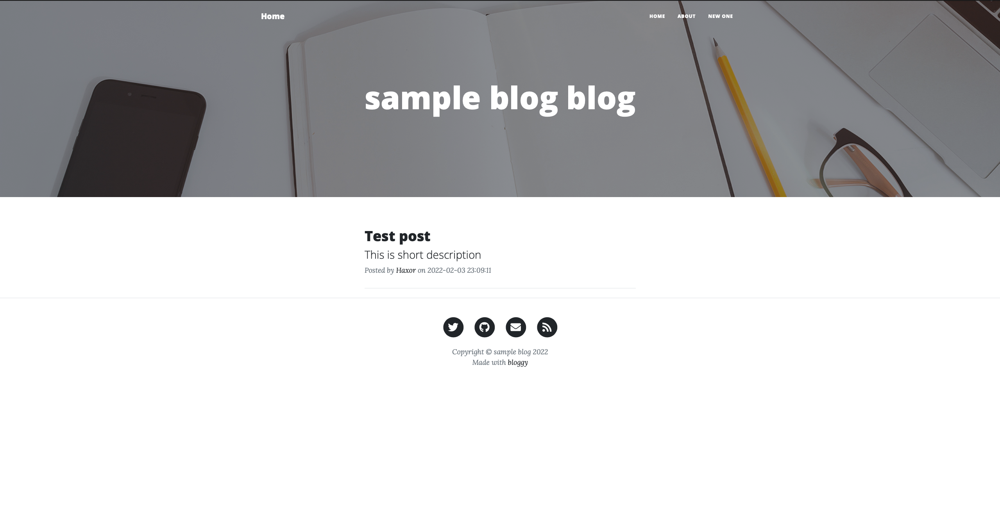

# bloggy
Custom static site generator. 

It uses the combination of yaml and markdown to create the post.

It is currently used by: 
* [https://nsecho.github.io](https://nsecho.github.io)
* [https://6en6ar.github.io](https://6en6ar.github.io)

# Installation

```bash
$ git clone https://github.com/lateralusd/bloggy.git
$ cd bloggy
$ go build
```



# Quick setup

To start, simply type `bloggy skeleton path_to_the_dir` which will create the necessary structure. 
Go to the newly created directory and inside the `public` is gonna be your generated webpage.

# Config file flags

* `url` - end path of the blog, eg. lateralusd.github.io (used for RSS)
* `title` - title of the blog
* `twitter` - your twitter handle
* `github` - path to your github page
* `mail` - your email
* `author` - author that will be embedded throughout the generated webpage
* `outdir` - output where bloggy will generate the webpage
* `about` - about text which should be rendered inside the about.html
* `diffblog` - diffblog key to embed view data on your page
* `posts_per_page` - how many posts per page, default is 5

# Custom data

If you would like to change default post, home and post backgrounds do as following inside the `custom` directory:

1. Image about-bg.jpg which will be used as the background for the about.html
2. Image home-bg.jpg which will be used as the background for the home.html
3. Image post-bg.jpg which will be used as the background for all posts

If you would like to use custom CSS, you can do so by creating `custom.css` inside the `custom` directory. 
Also, you can add `favicon.ico` to custom directory(this is still WIP).

# Referencing images

If you would like to have some images inside your generated post, first create the `images` directory 
inside the  directory.
Then, put the image or images there and you can reference them in your markdown as ``.

# Embedding files

Sometimes, you want to show some file content, you can do that easily inside your post 
with `embed:filepath:syntax`(e.g. `embed:/tmp/cfg.yaml:yaml`). Running `bloggy gen` the 
first time will substitute the line with the contents of the file.

# Generating

After you have created everything or you just want to test it, run `bloggy gen` inside the directory 
where you skeleton is stored and it will generate the webpage inside the `outdir` specified in the config file.

# Embedding gists

You can embed gist with `gist:/path/to/the/embed/script/code/from/the/gist.github.com`.

Example: `gist:https://gist.github.com/lateralusd/12sdffsdfssd.js`.

# CNAME

If you are also deploying your github pages to some other domain, you can configure `cname` inside your `cfg.yaml` file 
so that it creates `CNAME` file inside your generated directory.
